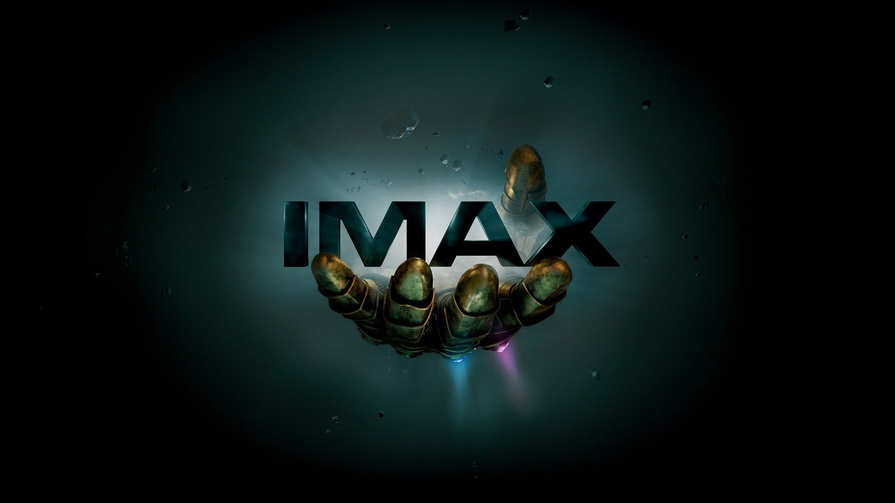

# Cinema App

Project Description 🎥
----------------------
This is a web application for the movie theater. The customer logs in to the application and can perform CRUD operations to purchase movie tickets.

The functionality and access of these users is limited depending on their role.

Features 🎞️
-----------
The app has authentication and authorization functions.The Cinema App stores data about movies, theaters, screenings, users, user roles, tickets, baskets, and orders in a relational MySQL database.

Everyone has access to the following pages: `/register` and `/login`

**Both `Users` and `Admins` can perform the following operations:**
- Get a list of all movies (`GET: /movies`); 
- Get a list of all cinema halls (`GET: /cinema-halls`);
- Get all movie sessions by a movie's id (`GET: /movie-sessions/{id}`);
- Get a list of all films that will be shown in the cinema on a given day (`GET: /movie-sessions/available`).

**Only `Users` can perform the following operations:**
- Get a list of all the orders made by a user (`GET: /orders`);
- Get your shopping cart (`GET: /shopping-carts/by-user`), add your order (`POST: /orders/complete`), change a movie session from your shopping cart by a movie session's id (`PUT: /shopping-carts/movie-sessions`).

**Only `Admins` can perform the following operations:**
- Add a movie (`POST: /movies`);
- Add a movie session (`POST: /movie-sessions`);
- Add a cinema hall (`POST: /cinema-halls `);
- Get a user by email (`GET: /users/by-email`);
- Change a movie session by its id (`PUT: /movie-sessions/{id}`); 
- Delete a movie session by its id (`DELETE: /movie-sessions/{id})`.

Technology Stack 💻
-------------------
- Java 11
- Hibernate
- Spring (Core, Web, Security)
- MySQL
- Apache TomCat 9.0.50
- Maven

Instructions for running this app 🚀
------------------------------------
In order to run this application, install MySQL and Apache TomCat 9.0.50 on your computer and follow the instructions:
1. Clone this project.
2. Create a schema in MySQL. Use the file `init_db.sql` form directory `resources`.
3. Create a connection to your database in the `resources` directory (`db.properties`).
4. Configure TomCat. Use `/` as your application context path.
5. You can now run this application by using a TomCat local server.
6. You can use credentials defined in the `DataIntializer` class to log in as `Admin`. In order to log in as `User`, you can either use the credentials defined in the above class or create a new account.
7. Use Postman or any other Software to send HTTP-requests and receive HTTP-responses :point_right: [**Postman**](https://www.postman.com/)

